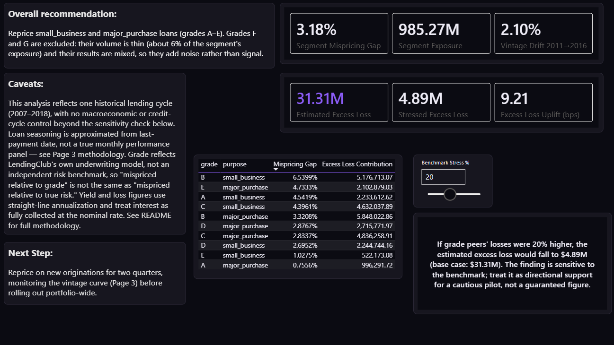

# LendingClub Credit Risk and Mispricing Dashboard

**Recommendation: reprice `small_business` and `major_purchase` loans in grades A–E.**

Within each grade, these two loan purposes lose more than their grade peers despite being priced about the same. Across grades A–E, realised net loss runs **3.18 percentage points** above the grade average on **$985.27M** of exposure. That's an estimated **$31.31M** of excess net loss over the observed book, or **9.21 bps** across the whole portfolio.

The finding is sensitive to the benchmark: if grade peers' losses were 20% higher, the estimate would fall to $4.89M. I'd treat it as support for a cautious, monitored pilot, rather than a number to bank on.



---

## Why I built this

This is the third project in my Power BI portfolio. The first two (Coffee Shop Sales and Real Estate) covered star schemas, Power Query and DAX on small, clean datasets. With this one I wanted to push three things further:

1. **Scale:** 2.26M rows, where modelling choices actually affect file size and speed.
2. **A real analytical problem:** credit risk (grade, rate, default, loss and yield) instead of another sales dashboard.
3. **A decision at the end:** a specific segment, a specific action and a dollar figure, with the caveats stated.

Before my current contract data analyst role, I was the sole data and BI person for Timeout Homes, across 21 regulated sites (18 children's homes and 3 schools). Regulated work is mostly judgement calls about messy definitions, so I picked a domain with the same flavour: deciding what counts as a "resolved" loan, when a vintage is "mature", and what a fair benchmark looks like.

---

## Data

The public LendingClub accepted-loans file from Kaggle (`accepted_2007_to_2018Q4.csv.gz`): 2,260,701 rows, 151 columns, June 2007 to December 2018. I also built a small `Ref_StateRegion.xlsx` lookup from the US Census Bureau's four-region split.

**The data isn't included in this repo** (the model's data cache is over 100MB). To open the project with data:

1. Download the CSV from [Kaggle](https://www.kaggle.com/datasets/wordsforthewise/lending-club).
2. Open `pbip/LendingClub.pbip` in Power BI Desktop.
3. Point the source step at your copy of the file, then refresh.

This is real, anonymised loan data. The mispricing benchmark and the recommendation are my own framework applied to it; they aren't a LendingClub figure, a regulatory finding or investment advice.

---

## Data model


**Grain:** one row per loan (`Fact_Loan`, 2,260,668 rows after removing 33 junk rows). The public file has no payment history, so loan level is the only grain available.

| Table | Contents | Notes |
|---|---|---|
| `Dim_Grade` | Grade (A–G), SubGrade (A1–G5), sort order | 35 rows, with an explicit sort column |
| `Dim_Purpose` | Loan purpose | |
| `Dim_EmpLength` | Employment length | |
| `Dim_Geography` | State, state name, region | Region merged from the Census lookup, not hand-typed |
| `Dim_LoanStatus` | Raw status and `RiskFlag` | The most important table in the model (below) |
| `Dim_LoanAttributes` | Verification × application type × listing status | A junk dimension, so three tiny attributes don't each need a table |
| `Dim_Date` | Daily calendar, marked as the date table | Source dates are month-only, so loans join to the 1st of the month |

It's a plain star schema: every dimension relates one-to-many to `Fact_Loan`, single direction, with no bidirectional filters.

**RiskFlag mapping.** Every risk measure only looks at resolved loans. A segment full of new loans would otherwise look safe just because they haven't had time to default yet.

| Raw status | RiskFlag |
|---|---|
| Fully Paid (including the "does not meet the credit policy" variant) | Resolved-Good |
| Charged Off, Default (including the credit-policy variant) | Resolved-Bad |
| Current, Issued | Open-Performing |
| In Grace Period, Late (16–30 days) | Open-Delinquent-Early |
| Late (31–120 days) | Open-Delinquent-Late |

**Performance.** Pruning about 145 raw columns down to 29 in Power Query, fixing data types early, turning off Auto Date/Time and moving repeated text into dimensions took the file from **360MB to 105MB** (about 71% smaller), with the same row count.

I didn't build incremental refresh, because this is a one-off historical extract that never changes. On a live version I'd partition by issue date and only refresh the recent periods where loans are still open.

**Dropped on purpose:** free-text fields (`emp_title`, `title`, `desc`, `url`), `zip_code` (redundant with state), `policy_code` (constant), and the hardship, settlement and joint-application fields. Joint applications are 5.3% of the book (120,710 loans); I scoped them out deliberately.

**Kept on purpose:** FICO scores at origination and the most recent pull. FICO is the most standard credit-risk variable there is, and it gives an independent check against grade: if FICO doesn't track grade for a segment, that's worth looking into on its own.

---

## The report


### 1. Portfolio Overview
The context before any claims: 2.26M loans, a 13.38% dollar-weighted average rate, a 19.98% charge-off rate among resolved loans, and **40.37% of the book still open**, shown up front so nothing later reads as more certain than it is. Also covers the grade and purpose mix, and funded volume over time.


### 2. Segment Mispricing
The core of the analysis. Instead of inventing an external pricing model, I used LendingClub's own grade as the benchmark. Grade is meant to price risk already, so the question is: **within a grade, does a loan purpose lose more than its grade peers?**

```dax
Grade Avg Net Loss Rate = CALCULATE([Net Loss Rate], REMOVEFILTERS(Dim_Purpose))
Mispricing Gap = [Net Loss Rate] - [Grade Avg Net Loss Rate]
```

A grade × purpose matrix shows every gap (red for worse than peers, green for better), and a scatter plots exposure against gap so big, mispriced segments stand out from small, noisy ones. `small_business` and `major_purchase` come out positive in every grade from A to E (up to +6.5pp). `debt_consolidation` has the biggest exposure in the book but a gap under 1pp in every grade, so its losses come from volume rather than mispricing.


### 3. Vintage Cohort Monitoring
The public file is a snapshot, not a monthly performance tape, so I approximated seasoning with `Months on Book = DATEDIFF(issue_d, last_pymnt_d, MONTH)` and said so on the page.

The key guard is `Is Vintage Mature`: a cohort only counts once its full term has passed. That stops a young cohort from looking "safe" just because it hasn't had time to go bad. I anchored it to the latest date in the data (`MAX(last_credit_pull_d)`) rather than `TODAY()`; otherwise, years after the extract, almost every loan would count as mature.

| Year | Charge-off rate | Annualised net loss rate |
|---|---|---|
| 2007 | 26.20% | 5.78% |
| 2008 | 20.73% | 4.86% |
| 2009 | 13.69% | 2.99% |
| 2010 | 14.01% | 2.37% |
| 2011 | 15.18% | 2.73% |
| 2012 | 16.20% | 3.04% |
| 2013 | 15.60% | 2.67% |
| 2014 | 15.09% | 2.55% |
| 2015 | 14.89% | 2.52% |
| 2016 | 17.28% | 3.20% |
| **Total** | **15.48%** | **2.70%** |

820K loans qualify as mature. Between 2011 and 2016 (both fully mature), the charge-off rate rose by **2.10 percentage points**, which suggests the problem wasn't fading over time. A bookmark toggle switches the curve chart between all cohorts and mature only, so you can see the censoring problem for yourself.


### 4. Recommendation
Laid out as a decision memo: the action, three proof points (3.18% gap, $985.27M exposure, 2.10pp drift), the $31.31M estimate with a row-by-row breakdown table so you can see exactly how it's built, the caveats, and a next step: pilot the reprice on new originations for two quarters and watch the vintage curve before going portfolio-wide.

**Why grades A–E, and not F and G?** F and G are thin (about 6% of the two purposes' exposure) and mixed: two of their four gaps are positive and two negative. Including them would add noise rather than signal. For reference, including all seven grades gives $32.00M.

**The benchmark sensitivity slider.** The slider raises the grade-peer benchmark by up to 50% and recalculates the estimate. At 20% it falls from $31.31M to $4.89M (about 84% lower). That happens because the gap is a thin layer on top of a much larger base loss rate, so a modest change in the benchmark eats most of it. It's the main reason I'd pilot this instead of rolling it out.

---

## Problems I hit and how I fixed them

- **UK locale vs US dates.** `Dec-2015`-style dates wouldn't parse on a UK machine. Fixed with Change Type → Using Locale → English (United States).
- **A visual filter that silently disappeared.** The vintage table's "mature only" filter got cleared while I was formatting, so the table showed 8.11pp of drift while a card showed 2.10pp. I split the calculation into scratch cards, found the table was the one that was wrong, and from then on put the important filters inside the DAX with `CALCULATE` instead of relying on visual filters.
- **A table total that didn't match its rows.** The breakdown table's total showed a different figure from the sum of its rows. A total row recalculates the measure once over everything, and with no single grade in context the benchmark becomes the whole-book average. The rows were right, so I hid the total and show the correct sum on its own card.
- **What-if parameter errors.** Referencing the parameter as `[Charge-off Stress %]` threw "no current row"; `SELECTEDVALUE('Charge-off Stress %'[Charge-off Stress %], 0)` fixed it.
- **Too many lines, too few colours.** Twelve vintage years shared an eight-colour palette. I made every line grey except the worst (red) and best (teal) years, and labelled them on the chart.
- **My own headline, after publishing.** Reviewing the project later, I found the headline figures covered all seven grades while the recommendation only targeted some of them. I added the grade filter to the measures so the numbers match the recommendation, and replaced the old "stress test" wording with what the slider actually tests (the benchmark).

---

## Python companion

`python/LendingClub_Python_Companion.ipynb` rebuilds the headline figures from the raw CSV in pandas, separately from Power BI. The grade × purpose breakdown matches the Power BI table row for row, and the all-grades total matches to the cent ($32,000,180.67); the A–E headline is the sum of 10 of those rows. Rebuilding it also surfaced the open-exposure assumption below.

---

## Limitations

- **One lending cycle, one lender.** 2007–2018 only, with no macroeconomic control beyond the sensitivity slider.
- **Part of the estimate is a projection.** Loss rates come from resolved loans only, but the dollar figure multiplies them by the segment's full exposure, including loans still open. With 40% of the book open, the $31.31M is partly the resolved pattern projected forward.
- **Grade is the benchmark, not the truth.** "Mispriced relative to grade" means worse than grade peers. If grade itself under-prices risk across the board, this analysis wouldn't show it.
- **Seasoning is approximated** from last-payment date, as described on Page 3.
- **Yield is simplified.** Risk-adjusted yield is the weighted rate minus annualised net loss; it ignores time value and assumes interest is collected in full. Annualisation is straight-line (`Term / 12`).
- **Loss is net of recoveries.** Net loss is funded amount minus principal repaid minus net recoveries, rather than a full write-off of every charged-off loan.

---

## Design

Dark theme with a single electric-violet accent (`#8B5CF6`), used for one number per page; on Page 4 that's the $31.31M. Red (`#E5484D`) means loss or worse than peers, and teal (`#3DD68C`) means good, on every page. Font: IBM Plex Sans.

---

## In this repo

- `pbip/`: the Power BI project (open `LendingClub.pbip`; the measures are readable in `LendingClub.SemanticModel/definition/tables/_Measures.tmdl`)
- `DAX_Measures.md`: every measure, with the reasoning behind it
- `screenshots/`: one image per page
- `python/`: the companion notebook
